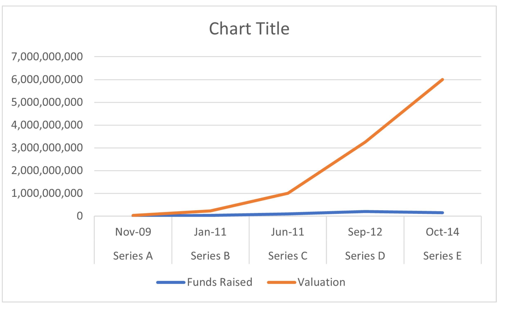
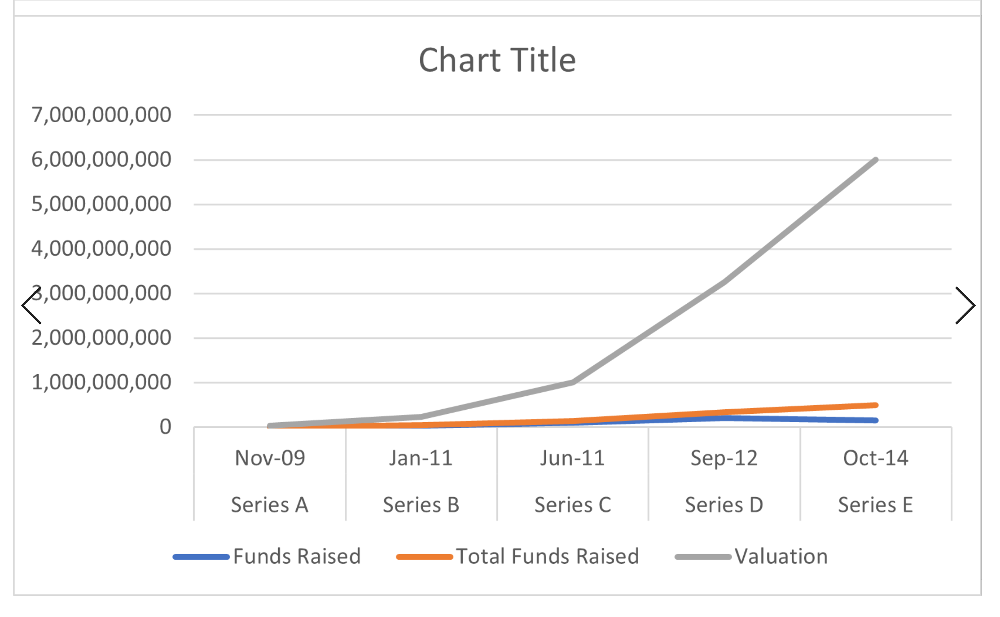
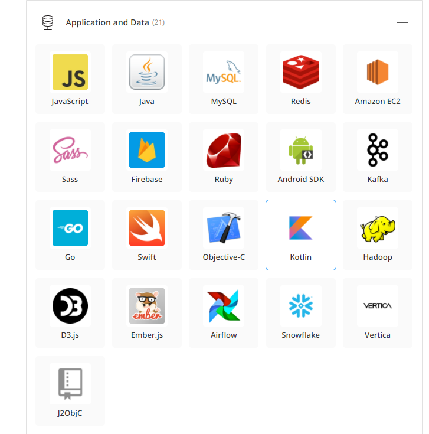
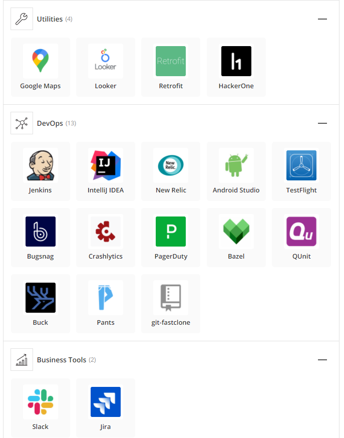
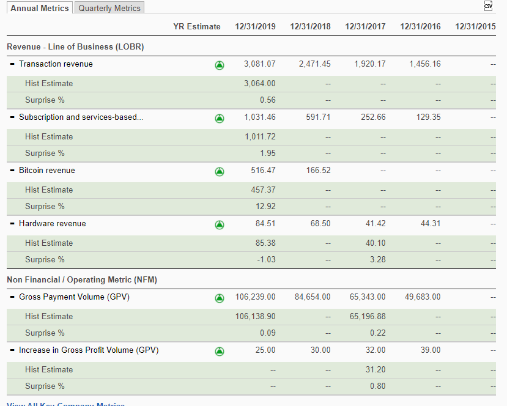
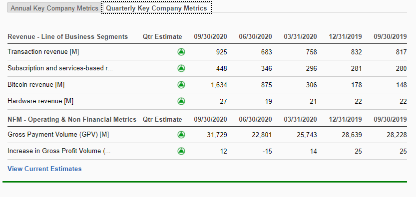
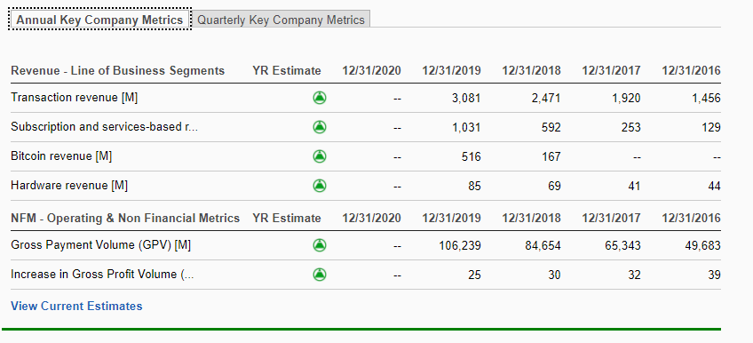

# UPennFinTech BootCamp - Homework #1 

# CASE STUDY - Square, Inc.

* Name of company? 
    Square, Inc.
* When was the company incorporated? 
    Square was founded in February 2009 in St.Louis, Missouri. The company is now based in San Francisio, California and has office locations globally in Canada, Japan, Australia, United Kingdom, and Ireland. The company has since went public with its IPO (Initial Public Offering) with the NYSE (New York Stock Exchange) on November 19th, 2015.
* Who are the founders of the company? 
    Square, Inc. was founded by Jack Dorsey, Jim McKelvey, and Tristan O'Tierney
* How did the idea for the company come about? 
    The idea for Sqaure, Inc. came about when founder, Jack Dorsey, was unable to complete a $2,000 sale of his glass faucet due to the inability to accept credit card as a form of payment. The company's name derives from the company's squared-shaped card readers.
* How is the company funded? How much funding have they received? 
    The company was funded primarily by venture capital. Venture capital by definition, is a form of private equity and a type of financing that an investor(s) can provide startup companies and small businesses that are believed to have long-term growth potential with funds to grow and scale the company in exchange for a percentage of its future growth. Venture capital does not always come in the form of monetary capital but can take a technical or managerial expertise.
    In November of 2009, Square raised roughly $10 Million through its initial round of funding (Series A), valuing the company at $30 Million. Some notable early adopters were Twitter co-founder Biz Stone, former Yahoo! CEO Marissa Mayer, and Napster founder Shawn Fanning. Square was quick to gain interest from small businesses and began processing millions of dollars in payments. This initial funding was critical to the development of Square’s first product, and most known product today, the white square-shaped credit card reader. In January 2011, Square closed on round 2 of funding (Series B) with $27.5 Million, valuing the firm at $230 Million. At this point was Square was processing $2-3 million dollars’ worth of payments weekly. This kind of growth forced Square to develop the square Register, which is now used in thousands of businesses around the world. Square struck a deal with Apple to sell its devices in Apple stores and with this increase in market visibility and huge endorsement they closed on round 3 of funding (Series C) in June 2011 for $100 Million, valuing the company at $1 Billion. In the summer of 2012, the company secured a deal with the coffee retailer, Starbuck’s, in exchange for a $25 Million investment in Square, they would become the credit card processer for the chain. This led to round 4 of funding (Series D) in September 2012, Square raised $200 Million at a valuation of $3.25 Billion. Square continued developing new products such as the square stand (which turns your standard iPad into a point-of-sale system), Square cash app, and Square Market (a tool to create online storefronts). In October 2014, Square closed on its 5th round of funding (Series E), $150 Million at a valuation of $6 Billion. Square would go on to raise more outside capital and eventually took the company public. On November 19th, 2015 began trading on the NYSE at $9 a share or a $2.9 Billon dollar valuation. As of close of business Febraury 12th, 2021, Square's stock price closed at all time highs of $272.75 per share, valuing the company at over ~$120 Billon.
    Below are two charts I created showing the relation of investment to market valuation of Square over time.
    
    

## Business Activities

* What specific financial problem is the company or project trying to solve?
    Square solves the real-world problem related to its customers number one priority of making more money. They provide customers with countless tools and platforms geared to providing a high level of service to its customers at an affordable price. Examples of these devices are the point-of-sale terminal both physical and virtual, checkout links, marketing, square card, payroll, business loans, dashboard interface and analytics, and gift cards.
* Who is the compamy's intended customer? Is there any information about the market size of this set of customers? What solution does this company offer that their competitors do not or cannot offer?
    Square’s intended customer is small businesses and largely anyone who physically accepts payment in any form. Square’s biggest differentiating factor is the lengthy vetting process that a traditional merchant performs when a business is looking to set up a new account. Square offers no application fee and a “come as you are” motto that has gained likes of thousands of businesses across the globe. Essentially allowing businesses to set up overnight. One of the biggest competitive advantages to Square verses its competitors is its fee structure. Square charges a flat 2.6% + 0.10 cents per swipe and there is no contract or hidden fees, no monthly fee, no early termination fees for leaving, and no long-term cmomitments. They were the first ever processor to offer a true pay-as-you-go processing. Where with a traditional merchant they may charge you a different rate for different forms of payment, a tiered pricing model based off transaction volume, age or solvency of your business, the industry you are providing service in. I.e. Visa credit card vs. American Express. On the contrary, this being said Square does have some disadvantages vs its competitors and that is that is does only charge a flat fee. A traditional merchant may be willing provide discounts to those users with high transactional volumes and the type of processing they require where square remains static across all data points. Another disadvantage of Squares service model is typically on traditional merchant accounts you will have a dedicated account manager willing to help and resolve any issues you may have. Square unfortunately, is unable to provide this level of 24/7 support a traditional merchant may be able to provide.
* Which technologies are they currently using, and how are they implementing them? You may want to search the company’s engineering blog or use sites like Stackshare to find this information
    Square, Inc. is using a multitude of applications for both cloud services (java and MySQL), coding languages (Amazon EC2), big data warehouses (snowflake and vertica), app platforms (Sass, Ruby and Firebase), API libraries (android SDK), google maps, communication tools (Slack and Jira), DevOps (Jenkins, INtellij IDEA, and Android studio). These platforms and technologies are all integrated to best provide a unique user experience that is relatable and transferrable across devices and the across globe.
    
    

## Landscape

* What domain of the finacial industry is this company in?
    Square, Inc. operates in the financial services industry with a specialization in payment/billing, capital and investment management, and enterprise solutions.
* What have been the major trends and innovations of this domain over the last 5-10 years?
    There are a couple major trends effecting this domain currently. As society is becoming more and more dependent on the instant gratification form of notifications, whether its through social media or some other form that the user is unaware of, companies like Square constantly need to evolve and update platforms and products that better tailor its services to increase the user’s experience. One-way companies are doing this is going from a physical form or product to the virtual cloud. Using Square, Inc. as the lead example, the ability to seamlessly process digital payments that work securely anywhere in the world and on any device. It is said that the average individual spends 11 hours a day online connected to some form or platform of media or content. An Example of how the industry is evolving through the cloud is the invention and the monetization of the QR code (QR - Quick Response). The QR code has taken the industry by storm and has enabled growth for merchants. QR codes can provide and present data, allows customers to pay for goods and services, link to portals, and provide real time notifications to both parties at the touch of a finger. This creates millions of individual point-of-sales terminals on any smartphone around the world – solving the issue of payments accepted anywhere. Another thing taking the industry by storm is the ability to transaction in and over our current favorite platforms i.e., Facebook, WeChat, Whatsapp, etc. Not only does this create tremendous value in the experience to the individual, it personalizes it, but also leverages social data, user trends and helps tailor future user experiences on the platform. The third trend is the ability to transaction seamlessly without borders. Companies are leveraging blockchain for its low friction, digital ledger to record transactions as they occur securely and digitally opening the door to a cashless society or a society where all different kinds of currencies and forms of payments are excepted. The last trend taking over this industry are API economies of scale. API stands for, application programming interfaces, these are our digital worlds connective tissue and have become industry standard on how companies exchange data and build smart, seamless, omni-channeled experiences the user demands. This also creates scalability as the business no longer has to own the entire chain and tailor its focus on just a link in the channel.
* What are the other major companies in this domain?
    Square, Inc. major competitors are Paypal, Verifone, Stripe, Clover, Chase, Braintree, Payment Depot, Shopify, Intuit, Fattmerchant, PaymentCloud, HEL CIM, and TSYS.

## Results

* What has been the business impact of this company so far?
    Square, Inc. has revolutionized the payments processing industry moving from a cash driven society to a virtual cashless society. Square, Inc. recently published data on the effects of COVID-19 and the effects it has had on consumer behavior and spending habits. They found that cash transactions are down 35 -40% year over year and predicted that without a global pandemic this would have taken roughly 3 years. They also reported that in February 2020 only about 5.4% of Square sellers were cashless, by April of 2020 they saw that number jump to as high as 23.2% during the height of the pandemic, and then stabilizing around 13.4% in August 2020. Square has been an industry leader in the payment processing space and is pushing the world to a cashless society that can accept payments on any device anywhere in the world.
* What are some of the core metrics that companies in this domain use to measure success? How is your company performing, based on these metrics?
    Please find some of the core metrics in the below screenshots. To provide a snapshot, transaction revenue has increased almost 25%, subscriptions are up 50%, Bitcoin revenue up 400%, and gross payment volume is up 26%. Square, Inc. is a large investor in bitcoin (roughly 1% of its total assets) in October 2020, square invested another $50 Million dollars in bitcoin and believes that cryptocurrency is an instrument of economic empowerment and provides a way for the world to participate in a global monetary system. Square’s stock price has increased almost 500% over the last two years and 70% over the trailing 12 months. The company’s EPS (Earnings Per Share) has jumped from $0.07 per share to over $0.13 a share in the same time frame and the year over year growth in adjusted EBITDA is an astonishing 107%.
    
    
    
* How is your company performing relative to competitors in the same domain?
    In the first three quarters of 2020, Square saw total revenue increase by 139.55% year on year verse its competitors average of just 12.87%. To note, Square saw a lower profitability than its competitors with a net profit margin of 1.2%. The payment processing market is ever evolving and becoming extraordinarily competitive with stiff competition on all fronts. If Square plans to retain its majority of the current market share it will need to continue to innovate and push the market forward. 

## Recommendations

* If you were to advise the company, what products or services would you suggest they offer? This could be something that a competitor offers, or use your imagination! Why do you think that offering this produc or service would benefit the company?Why do you think that offering this product or service would benefit the company?
    If I was Square, Inc. I would like to see them expand their current cash app offerings, to make the current platform more robust and progress to hopefully one day a cashless society. For me, “a millennial”, I hate carrying my wallet wherever I go and would not be caught dead without my phone in my hand. I love the Apple wallet and I think if Square were able to enhance their money transfer solutions and wallet capabilities to store not only credit cards, but gift cards, identification cards, insurance cards, and basically anything you would find in a traditional wallet this would greatly decrease the need for carrying anything physical and even potentially acting as a financial banking Institution - One stop shop.
    Not only would this decrease the need for a physical wallet but would drastically cut down on paper receipts at stores, the environmental costs of deforestation and climate change in a broad global view. Though this may sound like a very minute piece to a larger global issue, every little bit helps!
* What technologies would this additional product or service utilize? Why are these technologies appropriate for your solution?
    The technologies I would use would be Blockchain and A.I. Blockchain to provide the secure link and ledger to all transaction and A.I. to better predict and tailor the users experience. I believe these two technologies are vital to the progression towards a cashless society. We live in a rapidly changing technologically advanced world where data is becoming more and more commoditized. The end goal should always be user privacy and while also providing that user with exactly they want. 

## Addendum

# Cite Sources 

https://squareup.com/us/en

https://en.wikipedia.org/wiki/Square,_Inc.

https://www.fool.com/investing/2018/11/21/square-stock-history-a-complete-timeline.aspx#:~:text=Square%20Capital%20uses%20data%20from,a%20valuation%20of%20%246%20billion.

https://www.investopedia.com/terms/v/venturecapital.asp

https://www.merchantmaverick.com/square-vs-merchant-account/

https://www.quora.com/What-is-the-technology-stack-behind-Square

https://www.investopedia.com/articles/tech/021017/square.asp

https://finance.yahoo.com/quote/SQ?p=SQ&.tsrc=fin-srch

https://builtin.com/fintech/fintech-trends-credit-card-companies

https://usa.visa.com/visa-everywhere/innovation/5-digital-payment-trends-transforming-commerce.html

https://www.owler.com/company/squareup#competitors

https://www.fastcapital360.com/blog/square-competitors/

https://www.google.com/search?q=what+does+qr+stand+for&rlz=1C1VDKB_enUS936US936&oq=what+does+QR+st&aqs=chrome.0.0j69i57j0l3j0i390l2.4710j1j7&sourceid=chrome&ie=UTF-8

https://squareup.com/us/en/press/making-change-3

https://s21.q4cdn.com/114365585/files/doc_downloads/2020/04/SQ-Annual-Report-2020-Proxy-Statement_10-K(Bookmarked).pdf

https://www.zacks.com/stock/research/SQ/key-company-metrics

https://squareup.com/us/en/press/2020-bitcoin-investment

https://www.aol.com/news/5-metrics-capture-square-apos-222100441.html

https://csimarket.com/stocks/compet_glance.php?code=SQ

https://stackshare.io/square/square

